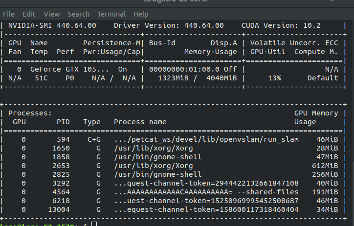
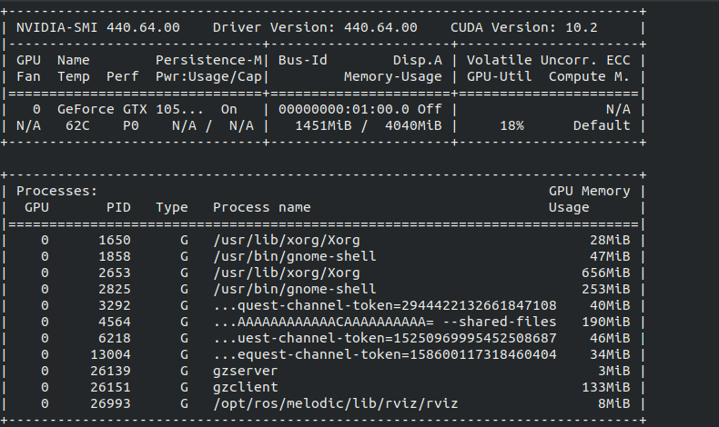
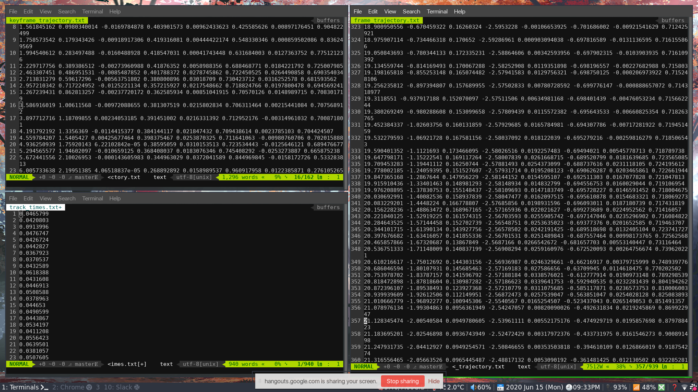

# PETcat_Benchmark
Repository for benchmarking various SLAM algorithms

The two main repos being used are :
 
https://github.com/chvmp/champ

https://github.com/xdspacelab/openvslam

The localization methods used:

1. [GMapping](https://openslam-org.github.io/)
2. [OpenVSLAM](https://openvslam.readthedocs.io/en/master/overview.html)

---

## CPU usage

**OpenVSLAM** : running with gazebo, pangolin viewer

The rqt_top data: 

**GMapping** : running with gazebo and rviz

The rqt_top data: 

---

## GPU info

**OpenVSLAM** : data without gazebo running, input is a video file

**GMapping** : running with gazebo and rviz

---

## Odometry Drift

**Openvslam** : Running run_slam on the aist dataset gave three .txt files. They contain frame coordinates, keyframe coordinates and the track timings for each frame. 

